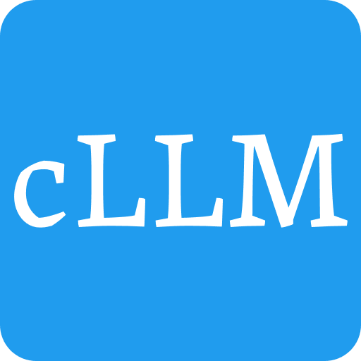

[](https://github.com/peterlau123/cLLM/actions/workflows/ubuntu.yml)
[](https://github.com/peterlau123/cLLM/actions/workflows/windows.yml)
[](https://github.com/peterlau123/cLLM/actions/workflows/code-quality.yml)
[](https://github.com/peterlau123/cLLM/actions/workflows/documentation.yml)
[](https://codecov.io/gh/peterlau123/cLLM)

<p align="center">
  
</p>

# cLLM

A lightweight and efficient C/C++ library for Large Language Model (LLM) inference. The **c** in cLLM stands for **crack** and **C/C++**, reflecting our goal to crack the complexities of LLM deployment and make it accessible everywhere.

## Features

- 🚀 **Lightweight**: Minimal dependencies, focusing on core functionality
- 🔧 **Extensible**: Easy to extend with custom models and optimizations
- 🎯 **Efficient**: Support for extreme low-bit quantization
- ⚡ **Fast**: Integration with TVM for model compilation
- 🛠️ **Flexible**: Support for OpenAI Triton and ThunderKittens kernels

## Supported Models

### Language Models

| Model | Parameters | Status |
|-------|------------|--------|
| Qwen | 1.8B | 🟡 In Development |
| | 7B | ⚪ Planned |
| | 14B | ⚪ Planned |
| DeepSeek | 7B | ⚪ Planned |
| | 67B | ⚪ Planned |
| Llama | 7B | ⚪ Planned |

### Vision Models
*Coming soon...*

## Quick Start

### Prerequisites

- CMake 3.14 or higher
- C++17 compatible compiler
- Conan package manager
- Python 3.10+ (for Conan)

### Building

1. **Clone the repository**
```bash
git clone https://github.com/peterlau123/cLLM.git
cd cLLM
```

2. **Install dependencies and build**
```bash
# Create and enter build directory
mkdir build && cd build

# Install dependencies with Conan
conan install .. --output-folder=. --build=missing

# Configure and build
cmake .. -DCMAKE_BUILD_TYPE=Release
cmake --build .
```

3. **Run tests**
```bash
# Run all tests
ctest --output-on-failure

# Run specific test
./bin/cLLM_tests
```

### Development

#### Code Style

We use clang-format for code formatting. To format your code:

```bash
# Install clang-format
pip install clang-format==14.0.6

# Format code
cmake --build build --target fix-format
```

#### Building Documentation

```bash
# Build documentation
cmake --build build --target docs

# View documentation
open build/docs/html/index.html
```

## Advanced Usage

### Model Quantization

```cpp
#include <cLLM/quantization.hpp>

// Example quantization code
auto quantized_model = cLLM::quantize_model(model, cLLM::QuantizationType::INT8);
```

### TVM Integration

```cpp
#include <cLLM/tvm.hpp>

// Example TVM compilation
auto compiled_model = cLLM::compile_with_tvm(model, "cuda");
```

### Custom Kernel Integration

```cpp
#include <cLLM/kernels.hpp>

// Example custom kernel usage
cLLM::register_custom_kernel("my_kernel", kernel_function);
```

## Contributing

We welcome contributions! Please see our [Contributing Guide](CONTRIBUTING.md) for details.

## License

This project is licensed under the MIT License - see the [LICENSE](LICENSE) file for details.

## Acknowledgments

- [TVM](https://tvm.apache.org/) for model compilation support
- [OpenAI Triton](https://github.com/openai/triton) for kernel optimizations
- [ThunderKittens](https://github.com/HazyResearch/ThunderKittens) for kernel implementations

## Contact

- GitHub Issues: [Create an issue](https://github.com/peterlau123/cLLM/issues)
- Email: [Your email]

## Star History

[](https://star-history.com/#peterlau123/cLLM&Date)
